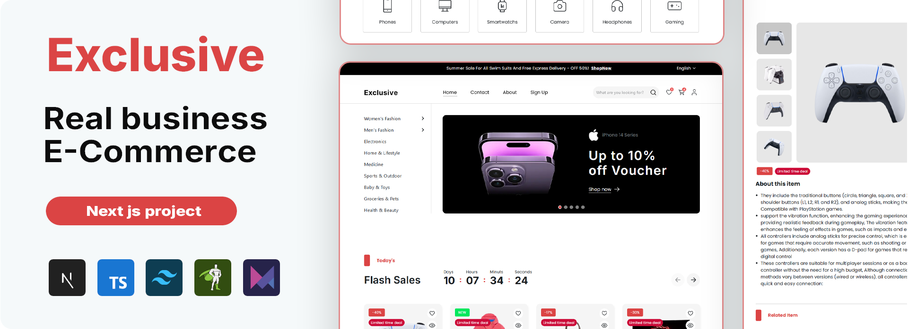

   
    
   

  

     
    
    
    
    
  

  <h3 align="center">Premium E-Commerce Platform</h3>

   
   
     A modern, production-ready ecommerce solution built with performance, scalability, and user experience in mind.  
     From premium UI components to clean architecture, this project demonstrates how I approach **professional web application development**.
    

## Project Overview
This ecommerce platform is not just a template — it’s a **solid foundation for real businesses**. It combines **high-end UI/UX**, **clean and scalable codebase**, and **robust features** that cover the entire online shopping flow.

Whether it’s product browsing, advanced filters, smooth checkout, or interactive authentication pages, everything is built with **attention to detail and future scalability**.

---

## Core Pages
- Home  
- About Us  
- Contact  
- Signup & Login  
- Cart & Wishlist  
- Checkout  
- My Account  
- Product Page  
- 404 – Not Found  
- Privacy Policy  
- Terms of Use  
- FAQ  
- Shop with Advanced Filters  

---

## Features

### UI & UX
- Internationalization (**i18n**) – multilingual support  
- Responsive Design – fully optimized for desktop, tablet, and mobile  
- Skeleton Loading – professional loading states  
- Error Handling – user-friendly with retry and fallbacks  
- Smooth Animations – powered by GSAP & Framer Motion  
- Premium Glassmorphism Header, Sidebar Navigation & Interactive Hero  

### E-Commerce Essentials
- Reusable **Product Card** with variations, wishlist, quick view modal  
- **Flash Sales & Campaign Offers** with countdown timers  
- **Advanced Shop Filters** (categories, price, rating, etc.)  
- **Dynamic Cart & Wishlist** with responsive layouts  
- **Secure Checkout Flow**  
- **My Account Dashboard** – orders, wishlist, account settings  

### Developer Experience
- Clean Code Architecture (hooks, utils, feature-based structure)  
- React Query for efficient API state management  
- TypeScript for type safety  
- TailwindCSS for scalable design system  
- Sentry for monitoring & error tracking  
- Future-proofed with lightweight state management (Zustand planned)  

---

## Tech Stack
* [![Next][Next.js]][Next-url]
* [![React][React.js]][React-url]
* 
* 
* [![tailwindcss][TailwindCSS]][tailwind-url]
- React Query  
- React Context & React Hook Form  
- Web APIs integration  

---

## Why This Project Matters
I built this platform as more than a coding exercise. It represents:
- My **ability to design and structure large-scale projects**.  
- My **focus on performance, accessibility, and SEO**.  
- My **commitment to writing clean, maintainable, and professional code**.  
- A project that could **power a real online business** with only minimal backend adjustments.  

This is the kind of work I want to be recognized for: building projects that are **production-grade, premium, and future-ready**.

---

## 🔗 Live Demo
[Visit the Live Site](https://e-commerce-jade-five-58.vercel.app/)

---

## Let’s Work Together
I’m open to collaborations, freelance projects, or full-time opportunities.  

📩 Reach me at **[yahialord4315@gmail.com](mailto:yahialord4315@gmail.com)**  
🌐 Explore my **[portfolio](https://portfolio25-one.vercel.app/)**  

---

## License
MIT License © 2025 Yahia Badr  

[TailwindCSS]:https://img.shields.io/badge/tailwindcss-%2338B2AC.svg?style=for-the-badge&logo=tailwind-css&logoColor=white
[tailwind-url]:https://tailwindcss.com/
[Next.js]: https://img.shields.io/badge/next.js-000000?style=for-the-badge&logo=nextdotjs&logoColor=white
[Next-url]: https://nextjs.org/
[React.js]: https://img.shields.io/badge/React-20232A?style=for-the-badge&logo=react&logoColor=61DAFB
[React-url]: https://reactjs.org/
